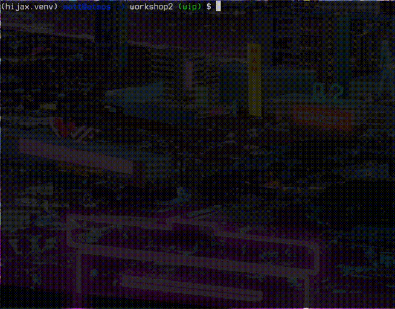

Hi, JAX!
========

"Hi, JAX!" is a short introduction to [JAX](https://jax.readthedocs.io/) for
deep learning researchers.
See the [course website](https://far.in.net/hijax) for details or to express
interest.

<table>
<tbody>
  <tr>
    <td></td>
    <td></td>
    <td></td>
  </tr>
  <tr>
    <td><!--workshop 4--></td>
    <td><!--workshop 5--></td>
    <td><!--workshop 6--></td>
  </tr>
  <tr>
    <td><!--workshop 7--></td>
    <td><!--workshop 8--></td>
    <td><!--workshop 9--></td>
  </tr>
</tbody>
</table>

Contents of this repository
---------------------------

This repository holds code relevant to each workshop. The code is currently
under development. This section describes the structure I'm working towards.

There is one folder for each workshop in the
  [syllabus](https://far.in.net/hijax#syllabus),
numbered 1 through 9:

* `workshop1`: Cellular automata using `jax.random` and `jax.numpy`.

* `workshop2`: Classic perceptron with SGD using `jax.grad`.

* `workshop3`: Multi-layer perceptron with minibatch SGD using `equinox`
  and `jax.tree`.

* `workshop4`: Convolutional neural network using `equinox.nn`, `jax.vmap`
  and `optax`.

* `workshop5`: Residual convolutional neural network using `jax.jit`.

* `workshop6`: Byte transformer using `jax.jit`.

* `workshop7`: Accelerated training loop using `jax.lax.scan`.

* `workshop8`: RL environment using `jax.lax.cond` and `jax.lax.select`.

* `workshop9`: PPO and GAE with `jax.lax.scan`.

There are three branches containing different versions of the code in
parallel.

* `main` contains the base code and data required for the start of each
  workshop (possibly empty).
  This is the place to start if you are following along with the workshops.

* `soln` contains pre-worked solutions to the workshops. (I can't guarantee
  that these will always be figured out ahead of the workshop).

* `live` contains the version of the code we write during the workshops.
  There might sometimes be differences from `soln` based on discussions in
  the workshop.

There are additional branches for my own testing purposes, in various states
of working order.

Maintaining a fork of this repository
-------------------------------------

Participants are encouraged to maintain their own fork of this repository
containing their solutions to each week's workshop exercises.

To create and clone a fork, follow these steps:

1.  **Create a fork:** 'Fork' this repository to create a copy of the
    repository under your own GitHub profile.
    You can create a fork with the 'fork' button or go to this URL:
    [https://github.com/matomatical/hijax/fork](https://github.com/matomatical/hijax/fork).

2.  **Clone into your environment:** Clone your forked repository into your
    local environment:
    ```
    git clone git@github.com:YOUR_USERNAME/hijax.git --origin my-fork
    ```

    Note: Usually, the local version would refer to the GitHub repository
    from which it was cloned as a **remote** called "origin". Use the option
    `--origin my-fork` to change this name of this remote to "my-fork".
    You can choose whatever name you like, to help you tell it apart from the
    original version of the repository (see next step).

3.  **Add a second remote:** add this GitHub repository to your local version
    as a remote called "upstream":
    ```
    git remote add upstream git@github.com:matomatical/hijax.git
    ```

This setup will allow you to easily pull updates I add to this repository
after your fork into your local version and push them to your fork.
To get the latest updates from a branch of this repository (e.g. `main`) into
a branch of your local repository, use the following commands:

```
# start in your local repository on the target branch
git fetch upstream
git merge upstream/main
```

Setting up your environment
---------------------------

The recommended approach for completing these workshops is to set up a
dedicated virtual environment.
Once you have a local copy of the repository, follow these steps to set up
your environment:

1.  Create a virtual environment:
    ```
    python3 -m venv hijax.venv
    ```
    (You can run this command wherever you like, I normally run it inside the
    repository root. The repository is set up to ignore contents with name
    `*.venv`).

2.  (Each time you want to work in the virtual environment)
    Activate the virtual environment:
    ```
    source hijax.venv/bin/activate
    ```
    (You may consider adding an alias to your shell config such as
    `activate-hijax=source "/path/to/hijax.venv/bin/activate"`)

3.  Install the regular python dependencies. This list may grow in future
    weeks---install missing dependencies as needed.

    * Start by upgrading `pip`:
      ```
      pip install --upgrade pip
      ```
    
    * Then some basics for array manipulation:
      ```
      pip install numpy einops
      ```

    * Some tools for launching, visualising, and monitoring experiments:
      ```
      pip install tyro pillow plotille tqdm
      ```

4.  The command for installing JAX itself depends on whether you want to
    compile to CPU, GPU or TPU. Follow the instructions on the jax website:
    https://jax.readthedocs.io/en/latest/installation.html
     

5.  After installing jax we can install some libraries that work on top of
    it:

    ```
    pip install equinox optax jaxtyping
    ```

Whenever you are done with your virtual environment, you can leave it using
the command `deactivate`. You'll then have to repeat step (2) again next
time. You won't have to repeat steps (1), (3), (4), or (5).


Course participants
-------------------

The following public repositories showcase the work of course participants.

* [Example] Matthew Farrugia-Roberts's fork:
  https://github.com/matomatical/hijax
* Rohan Hitchcock's fork: 
  https://github.com/rohan-hitchcock/hijax
* Rumi Salazar's fork:
  https://github.com/rumi-salazar/hijax
* Billy Snikkers' fork:
  https://github.com/blinkybool/hijax

Participants are encouraged to create a pull request from their fork to this
repository appending a link to their fork to the above list.
